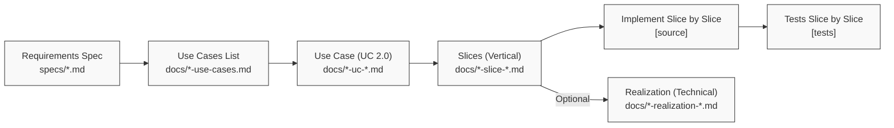

# CLAUDE.md

This file provides guidance to Claude Code (claude.ai/code) when working with this repository.

## Quick Start

```bash
# Always start with progress check
/progress

# Build the project (customize for your stack)
[your build command]

# Run tests (customize for your stack)
[your test command]
```

## Session Start Workflow

**ALWAYS run `/progress` at the start of each session** to get an overview of project status, identify gaps, and get suggested next actions.

## Daily Development Loop

Here's the most common workflow for day-to-day development:

```bash
# Check project status and get next tasks
/progress

# Build the project
[your build command]

# Run tests
[your test command]

# Create a use case (lightweight, value promise)
/use-case UC-SOME-ID

# Break it into slices (vertical implementation units)
/slice UC-SOME-ID S1
/slice UC-SOME-ID S2

# Implement slice-by-slice with Git workflow
/implement UC-SOME-ID-S1    # Creates branch, implements, merges to develop
/test UC-SOME-ID-S1

# Optional: Document complex technical decisions
/realization UC-SOME-ID-S1

# After several slices, /progress will suggest a release
/progress
```

## Git Workflow

This project uses a **branch-per-slice** Git workflow integrated with Use-Case 2.0 development.

### Branch Strategy

```
main              # Production releases only
  └─ develop      # Integration branch for completed slices
       ├─ slice/UC-AUTH-001-S1    # Feature branch for slice S1
       ├─ slice/UC-AUTH-001-S2    # Feature branch for slice S2
       └─ slice/UC-API-001-S1     # Feature branch for another slice
```

### Workflow Per Slice

1. **Start slice**: Create branch from `develop`
   ```bash
   git checkout develop
   git pull origin develop
   git checkout -b slice/UC-AUTH-001-S1
   ```

2. **Implement**: Work on the slice (via `/implement`)

3. **Test**: Run tests and verify (via `/test`)

4. **Merge**: Merge back to `develop`
   ```bash
   git checkout develop
   git merge --no-ff slice/UC-AUTH-001-S1 -m "Merge slice UC-AUTH-001-S1: Basic password login"
   git branch -d slice/UC-AUTH-001-S1
   git push origin develop
   ```

### Release Workflow

After completing a logical set of slices (typically 3-5), `/progress` will suggest creating a release:

```bash
# When /progress suggests a release
git checkout main
git merge --no-ff develop -m "Release v1.0.0: Authentication feature"
git tag -a v1.0.0 -m "Release v1.0.0"
git push origin main --tags
git checkout develop
```

### Naming Conventions

| Type | Pattern | Example |
|------|---------|---------|
| Slice branch | `slice/<Slice-ID>` | `slice/UC-AUTH-001-S1` |
| Release tag | `v<MAJOR>.<MINOR>.<PATCH>` | `v1.0.0`, `v1.1.0` |
| Commit message | `<type>: <description>` | `feat: add password validation` |

### Commit Message Types

- `feat`: New feature (slice implementation)
- `fix`: Bug fix
- `test`: Adding or updating tests
- `docs`: Documentation changes
- `refactor`: Code refactoring without behavior change

### `/implement` Git Integration

When running `/implement <Slice-ID>`:
1. **Auto-creates** branch `slice/<Slice-ID>` from `develop`
2. **Implements** the slice according to specification
3. **Commits** changes with meaningful messages
4. **Optionally merges** back to `develop` (asks for confirmation)

### `/progress` Release Suggestions

The `/progress` command tracks merged slices and suggests releases when:
- A use case is **fully completed** (all slices merged to develop)
- **3+ slices** have been merged since last release
- A **milestone** has been reached (all high-priority slices done)

## Build Commands

**IMPORTANT**: Customize this section for your project's technology stack.

```bash
# Build (example - customize for your stack)
npm run build        # For Node.js projects
cargo build          # For Rust projects
./gradlew build      # For Java projects
dotnet build         # For .NET projects

# Run tests (example - customize for your stack)
npm test             # For Node.js projects
cargo test           # For Rust projects
pytest               # For Python projects
./gradlew test       # For Java projects
```

## Project Overview

[Describe your project here - what it does, its purpose, and main components]

**Example**:
This is a web API service that provides authentication and user management. It includes:
- RESTful API endpoints
- JWT-based authentication
- User registration and profile management
- Role-based access control

## Claude Code Integration

This project includes custom Claude Code commands and skills in `.claude/`:

- **Commands** (`.claude/commands/`): Slash commands like `/progress`, `/implement`, `/test`
- **Skills** (`.claude/skills/`): Detailed workflow implementations referenced by commands

For detailed command usage, see individual `.md` files in `.claude/commands/`.

## Project Structure

```
project/
├── [customize this for your project structure]
├── specs/              # Requirements specifications
├── docs/               # Use case documents and templates
├── .claude/            # Claude Code commands and skills
│   ├── commands/       # Slash commands
│   └── skills/         # Workflow implementations
└── [your source directories]
```

**Development Philosophy**: [Describe your project's development philosophy, constraints, and principles]

## Code Rules

### Project-Specific Conventions

[Customize this section for your project]

**Example guidelines to include**:
- Naming conventions for files, functions, classes
- Code style and formatting rules
- Error handling patterns
- Testing requirements
- Documentation standards
- Security considerations

### Example Structure:

```
NAMING CONVENTIONS:
- Files: snake_case.ext or kebab-case.ext
- Functions: camelCase or snake_case
- Classes: PascalCase
- Constants: SCREAMING_SNAKE_CASE

CODE STYLE:
- [Your linter/formatter rules]
- [Indentation standards]
- [Comment requirements]

ERROR HANDLING:
- [How to handle errors in your project]
- [Logging standards]

TESTING:
- [Test coverage requirements]
- [Testing frameworks used]
- [Where to put tests]
```

## Requirements-Driven Development with Use-Case 2.0

This project follows a formal requirements engineering process using **Use-Case 2.0** methodology with vertical slicing.

### Key Concepts

**Use-Case 2.0** (Ivar Jacobson, 2011):
- ✅ **Use Case** = Promise of business value (lightweight, 2-3 pages)
- ✅ **Slice** = Unit of implementation (vertical, independently valuable)
- ❌ **Use Case** ≠ Monolithic implementation specification

**Vertical Slices**:
- Cut through all layers (UI/API → Logic → Data)
- Independently deployable and testable
- Deliver observable business value
- Enable incremental delivery and risk management

### Development Pipeline


### Directory Structure

| Directory | Purpose | Examples |
|-----------|---------|----------|
| `specs/` | Requirements specifications | `auth-spec.md`, `api-spec.md` |
| `docs/` | Use cases and templates | `auth-use-cases.md`, `auth-uc-login.md` |
| `.claude/commands/` | Slash commands | `/progress`, `/test`, `/implement` |
| `.claude/skills/` | Detailed workflow docs | Referenced by commands |

### Available Commands

Commands are in `.claude/commands/` and invoked with `/`:

| Command | Purpose |
|---------|---------|
| `/requirements <module>` | Create requirements specification from domain analysis |
| `/use-cases <spec>` | Generate prioritized use cases list from spec |
| `/use-case <UC-ID>` | Create Use-Case 2.0 document (lightweight, value-focused) |
| `/slice <UC-ID> <S#>` | Create a vertical slice - THE unit of implementation |
| `/implement <Slice-ID>` | Implement a slice (or legacy: use case) |
| `/test <Slice-ID>` | Write tests for a slice from BDD acceptance criteria |
| `/realization <Slice-ID>` | (Optional) Create technical deep-dive for complex slices |
| `/progress [filter]` | Track progress, identify gaps, suggest next actions |

### Workflow Example (Use-Case 2.0)

```bash
# 1. Create requirements spec
/requirements auth-service

# 2. Generate use cases list
/use-cases specs/auth-spec.md

# 3. Create use case (lightweight, business value)
/use-case UC-AUTH-001

# 4. Decompose into vertical slices
/slice UC-AUTH-001 S1    # Basic password login
/slice UC-AUTH-001 S2    # Session management
/slice UC-AUTH-001 S3    # Account lockout

# 5. Implement slice-by-slice (incremental delivery)
/implement UC-AUTH-001-S1
/test UC-AUTH-001-S1

# 6. (Optional) Document complex technical decisions
/realization UC-AUTH-001-S1

# 7. Move to next slice
/implement UC-AUTH-001-S2
/test UC-AUTH-001-S2

# 8. Check progress
/progress
```

### Why Slices?

**Old Approach** (monolithic use cases):
- ❌ Large, risky implementations
- ❌ Delayed feedback and value
- ❌ Difficult to test incrementally
- ❌ All-or-nothing delivery

**New Approach** (vertical slices):
- ✅ Small, manageable units (1-3 days)
- ✅ Immediate value delivery
- ✅ Early risk reduction
- ✅ Incremental deployment
- ✅ Better testability

### Document Templates

- **Requirements Template**: `docs/requirements-template.md`
- **Use Cases List Template**: `docs/use-cases-list-template.md`
- **Use-Case 2.0 Template**: `docs/use-case-2.0-template.md` ⭐ (Lightweight, business-focused)
- **Slice Template**: `docs/slice-template.md` ⭐ (THE implementation unit)
- **Realization Template**: `docs/realization-template.md` (Optional technical deep-dive)
- **Legacy Use Case Template**: `docs/use-case-template.md` (Full RUP style - deprecated)

**Primary Templates** (Use-Case 2.0):
- Use Case: Goal, Scope, Actors, Preconditions, Postconditions, Related Requirements, **Planned Slices**
- Slice: Objective, Scenario, Flow, Agents & Responsibilities, Messages/Contracts, Business Rules, **BDD Acceptance Criteria**, Test Strategy
- Realization (Optional): Agent Network, Sequence Diagrams, Technical Decisions, Performance, Security

### Slice and Test Tracking

**Use-Case 2.0 Approach**:
- Each use case (Section 8) contains planned slices with status
- Each slice document (Section 7) contains BDD acceptance criteria
- Each slice document (Section 11) tracks implementation statusslice statuses and suggests which slices to implement next.

**Legacy Approach**:
- Use case document (Section 12) contains test cases with status
- The `/progress` command scans these for backward compatibility

### Naming Conventions

| Type | Pattern | Example |
|------|---------|---------|
| Use Case ID | `UC-<MODULE>-<NUM>` | `UC-AUTH-001`, `UC-API-002` |
| Test Case ID | `TC-<UC-ID>-<CAT><NUM>` | `TC-AUTH-001-01`, `TC-AUTH-001-E01` |
| Use Case Doc | `<module>-uc-<name>.md` | `auth-uc-login.md` |
| Spec Doc | `<module>-spec.md` | `auth-spec.md` |

## Before Implementing Changes

1. Read the relevant **SPEC file** in `specs/` if it exists
2. Read the related files you'll modify
3. Ask if something is unclear - don't assume
4. Propose a plan before writing code
5. Follow project coding standards

## Technology Stack

[Customize this section for your project]

**Example**:
- **Language**: [e.g., TypeScript, Python, Rust]
- **Runtime**: [e.g., Node.js 20+, Python 3.11+]
- **Framework**: [e.g., Express, FastAPI, Actix]
- **Database**: [e.g., PostgreSQL, MongoDB]
- **Testing**: [e.g., Jest, pytest, cargo test]
- **Build Tool**: [e.g., npm, poetry, cargo]

## Development Environment Setup

[Customize this section with setup instructions]

**Example**:
```bash
# Install dependencies
npm install

# Set up environment variables
cp .env.example .env

# Run database migrations
npm run migrate

# Start development server
npm run dev
```

## Additional Notes

[Add any project-specific notes, quirks, or important information that Claude should know]

---

*This template is based on requirements-driven development with Claude Code. Customize all sections marked with [brackets] for your specific project.*
