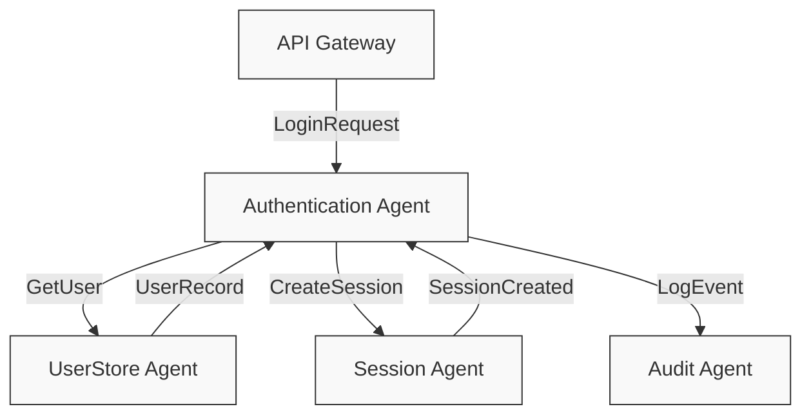
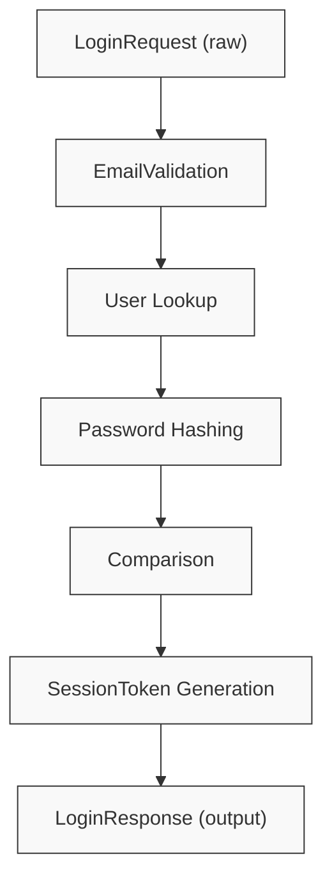

# Technical Realization: [Slice-ID]

> **Optional Deep-Dive for Complex Slices**
> Use when architectural decisions, message flows, or agent interactions need visualization
> NOT required for simple slices

---

## 1. Slice Reference

**Slice**: [Link to slice-[ID].md]
**Use Case**: UC-[ID]
**Purpose**: [Why this realization document exists - complexity, risk, team alignment, etc.]

---

## 2. Architecture Overview

### 2.1 Agent Network

```
[ALWAYS use mermaid diagram showing agent relationships]



### 2.2 Components & Layers

| Layer | Components | Responsibility |
|-------|------------|----------------|
| Presentation | API Gateway | HTTP request handling |
| Application | AuthenticationAgent, SessionAgent | Business logic |
| Domain | User, Session entities | Core domain model |
| Infrastructure | UserStore, AuditLog | Persistence, external I/O |

---

## 3. Message Sequence Diagram

```
[Sequence diagram for the slice's main scenario]

Example (mermaid):

sequenceDiagram
    participant User
    participant API
    participant AuthAgent
    participant UserStore
    participant SessionAgent
    participant AuditAgent

    User->>API: POST /login {email, password}
    API->>AuthAgent: LoginRequest(email, password)
    AuthAgent->>UserStore: GetUser(email)
    UserStore-->>AuthAgent: UserRecord
    AuthAgent->>AuthAgent: ValidatePassword(password, hash)
    AuthAgent->>SessionAgent: CreateSession(userId)
    SessionAgent-->>AuthAgent: SessionToken
    AuthAgent->>AuditAgent: LogEvent(LOGIN_SUCCESS)
    AuthAgent-->>API: LoginResponse(token)
    API-->>User: 200 OK {token}
```

---

## 4. Data Flow

### 4.1 Input Data Transformation



### 4.2 Persistent State Changes

| Entity | Before | After |
|--------|--------|-------|
| User | `failedAttempts: 2` | `failedAttempts: 0, lastLoginAt: <now>` |
| Session | - | New record: `{userId, token, expiresAt}` |
| AuditLog | - | New event: `{LOGIN_SUCCESS, userId, timestamp}` |

---

## 5. Technical Decisions

### Decision 1: [Decision title]

**Context**: [What problem or choice did we face?]

**Options Considered**:
1. [Option A]: [Pros/Cons]
2. [Option B]: [Pros/Cons]

**Decision**: [What we chose]

**Rationale**: [Why we chose it]

**Consequences**: [Trade-offs, technical debt, future implications]

**Example**:

### Decision 1: Session Storage Strategy

**Context**: Need to store session tokens for fast lookup and automatic expiration.

**Options Considered**:
1. **Database (PostgreSQL)**
   - Pros: Durable, transactional, familiar
   - Cons: Slower, requires manual TTL cleanup

2. **In-memory (Redis)**
   - Pros: Fast, native TTL support, scales horizontally
   - Cons: Requires separate infrastructure, potential data loss on crash

**Decision**: Use Redis for session storage

**Rationale**:
- Session data is ephemeral (30min TTL)
- Speed is critical for every authenticated request
- Redis TTL handles expiration automatically
- Acceptable to lose sessions on Redis failure (users re-login)

**Consequences**:
- Add Redis to deployment requirements
- Need Redis backup/HA strategy for production
- Consider fallback to DB if Redis unavailable (future enhancement)

---

## 6. Error Handling Strategy

| Error Condition | Detection | Response | Recovery |
|----------------|-----------|----------|----------|
| [Error type] | [How detected] | [What system does] | [How to recover] |

**Example**:
| Error Condition | Detection | Response | Recovery |
|----------------|-----------|----------|----------|
| User not found | UserStore returns null | Return INVALID_CREDENTIALS | User checks email, creates account |
| Password mismatch | bcrypt.compare returns false | Return INVALID_CREDENTIALS | User retries, requests reset |
| Account locked | User.isLocked == true | Return ACCOUNT_LOCKED | Wait 30min or contact support |
| Session creation fails | SessionAgent throws error | Return SERVER_ERROR | Retry request |
| Audit log fails | AuditAgent throws error | Log warning, continue | Background job retries audit |

---

## 7. Performance Considerations

### 7.1 Expected Load

- **Peak requests/sec**: [Number]
- **Average response time**: [Target in ms]
- **Concurrent users**: [Estimate]

**Example**:
- Peak: 100 logins/sec
- Target latency: <200ms p95
- Concurrent users: 10,000 active sessions

### 7.2 Bottlenecks & Mitigations

| Bottleneck | Impact | Mitigation |
|------------|--------|-----------|
| [Resource] | [Effect] | [Solution] |

**Example**:
| Bottleneck | Impact | Mitigation |
|------------|--------|-----------|
| Bcrypt hashing | CPU-intensive, slow | Use async workers, limit concurrent hashes |
| Database user lookup | I/O latency | Add index on email, consider read replica |
| Session token generation | Crypto overhead | Pre-generate token pool, use efficient library |

---

## 8. Security Considerations

| Threat | Mitigation |
|--------|-----------|
| [Attack vector] | [Defense mechanism] |

**Example**:
| Threat | Mitigation |
|--------|-----------|
| Brute force password guessing | Rate limiting, account lockout after 5 attempts |
| Timing attacks | Use constant-time comparison for password |
| Session hijacking | HTTPS only, httpOnly cookies, short TTL |
| Credential stuffing | Monitor for suspicious patterns, CAPTCHA |
| SQL injection | Parameterized queries, ORM with sanitization |

---

## 9. Testing Strategy (Detailed)

### 9.1 Unit Tests
[Only include them if they test something complex, don't add tests for simple tasks, only for
really error prone functions, also don't test libraries, always asume their documentation is right
unless proven otherwise]
```
AuthenticationAgent.validatePassword()
  ✓ should return true for matching password
  ✓ should return false for incorrect password
  ✓ should handle null or empty password
  ✓ should handle malformed hash

SessionAgent.createSession()
  ✓ should generate valid JWT with correct claims
  ✓ should set expiration to 30 minutes
  ✓ should include userId in payload
```

### 9.2 Integration Tests

```
POST /api/login
  ✓ successful login with valid credentials
  ✓ failed login with invalid password
  ✓ account locked after 5 failures
  ✓ session token is valid for authenticated requests
  ✓ audit log records login events
```

### 9.3 Load Tests

[Only put this section if there exists a load tests strategy defined in the CLAUDE.md]
```
- 100 concurrent logins with valid credentials
- Expected: <200ms p95, 0% errors
- Monitors: CPU, memory, DB connections, Redis ops
```

---

## 10. Monitoring & Observability

### 10.1 Metrics

- `auth.login.attempts` (counter, labels: success/failure)
- `auth.login.duration` (histogram)
- `auth.account.locked` (counter)
- `session.active.count` (gauge)

### 10.2 Logs

- `INFO`: Successful logins (userId, IP)
- `WARN`: Failed login attempts (email, IP)
- `ERROR`: Account lockouts, system errors

### 10.3 Alerts

- Error rate >5% for 5 minutes
- P95 latency >500ms for 10 minutes
- Redis connection failures

---

## 11. Deployment Notes

### 11.1 Configuration

```yaml
auth:
  bcrypt_cost: 12
  session_ttl: 1800  # 30 minutes
  max_failed_attempts: 5
  lockout_duration: 1800  # 30 minutes

redis:
  host: redis.internal
  port: 6379
  db: 1
```

### 11.2 Database Migrations

[It may not need migrations or they might not be in sql]
```sql
-- Add index for email lookup performance
CREATE INDEX idx_users_email ON users(email);

-- Add columns for account lockout
ALTER TABLE users ADD COLUMN failed_attempts INTEGER DEFAULT 0;
ALTER TABLE users ADD COLUMN is_locked BOOLEAN DEFAULT FALSE;
ALTER TABLE users ADD COLUMN last_login_at TIMESTAMP;
```

### 11.3 Dependencies

[Here document if a new library was added for the process and the rationale behind it, if the CLAUDE.md
says that this project doesn't rely on external libraries don't include this section]
---

## 12. Future Enhancements

- [ ] Add "remember me" functionality (30-day sessions)
- [ ] Implement refresh token rotation
- [ ] Support OAuth2 providers (Google, GitHub)
- [ ] Add WebAuthn/passkey support
- [ ] Geo-blocking for suspicious locations

---

## 13. Revision History
[If you are reading this file and have changed any part of it modify this, increment the version
minor or mayor with a new row (depending on how big the change was) and update the date]
| Version | Date | Author | Changes |
|---------|------|--------|---------|
| 1.0 | [date] | [name] | Initial realization |

---

## Related Artifacts

- **Slice Spec**: [Link to slice-[ID].md]
- **Use Case**: [Link to UC-[ID] document]
- **Source Code**: [Links to implemented files]
- **Tests**: [Links to test files if any]
- **Other documentation**: [Here you may reference related documents needed to be loaded in context, 
since sometimes some conversations are saved in docs\*.md with resumes of specific information from 
a website/paper/debate with the ai, it can also reference related use cases/slices which context may 
be needed to complete the task properly]

---

*Realization Template - Optional Technical Deep-Dive*
*Use sparingly: Only when complexity, risk, or team alignment requires it*
