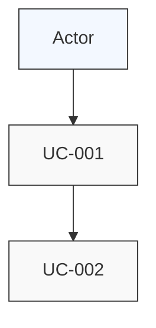

# [Project Name] - Use Cases List

> **Template based on Rational Unified Process (RUP)**

---

## 0. META-INSTRUCTIONS

```
PROJECT-SPECIFIC CODING GUIDELINES:
(Customize this section for your project)

Example guidelines to include:
- Technology stack
- Coding conventions
- Architecture patterns
```

---

## 1. Actors

### 1.1 Actor Descriptions

| Actor | Description | Type |
|-------|-------------|------|
| [Actor Name] | [What this actor represents] | [Primary/Secondary/External] |

---

## 2. Use Case Diagram



---

## 3. Use Cases Summary

### 3.1 Core Use Cases

| ID | Name | Actor(s) | Priority | Complexity | Status |
|----|------|----------|----------|------------|--------|
| UC-[XXX] | [Name] | [Actor] | [High/Med/Low] | [High/Med/Low] | [Draft/Review/Approved] |

### 3.2 Supporting Use Cases

| ID | Name | Actor(s) | Priority | Complexity | Status |
|----|------|----------|----------|------------|--------|
| UC-[XXX] | [Name] | [Actor] | [High/Med/Low] | [High/Med/Low] | [Draft/Review/Approved] |

---

## 4. Use Case Dependencies

```
[Dependency diagram]

UC-001 (Main Feature)
    |
    +---> UC-002 (Sub-feature A)
    |
    +---> UC-003 (Sub-feature B)
              |
              +---> UC-004 (Detail)
```

---

## 5. Use Case to Requirements Traceability

| Use Case | Requirements Covered |
|----------|---------------------|
| UC-[XXX] | REQ-[XXX], REQ-[YYY] |

---

## 6. Use Case Document Links

| Use Case | Document |
|----------|----------|
| UC-[XXX] | [link to detailed use case document] |

---

## 7. Revision History

| Version | Date | Author | Description |
|---------|------|--------|-------------|
| 1.0 | [date] | [author] | Initial version |

---

*Template based on RUP Use Case Model*
